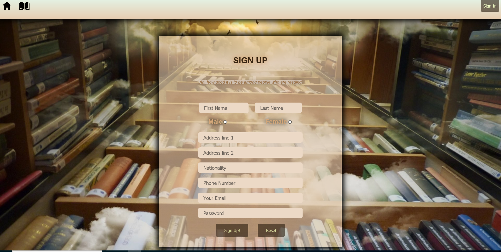
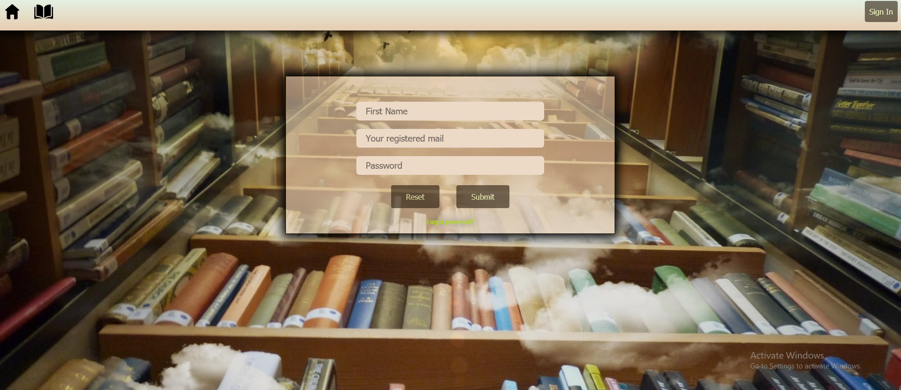
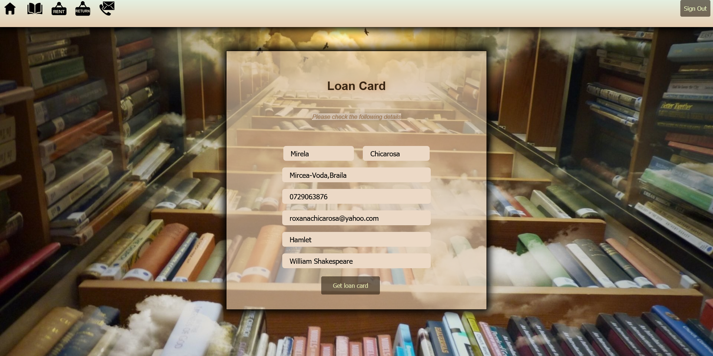
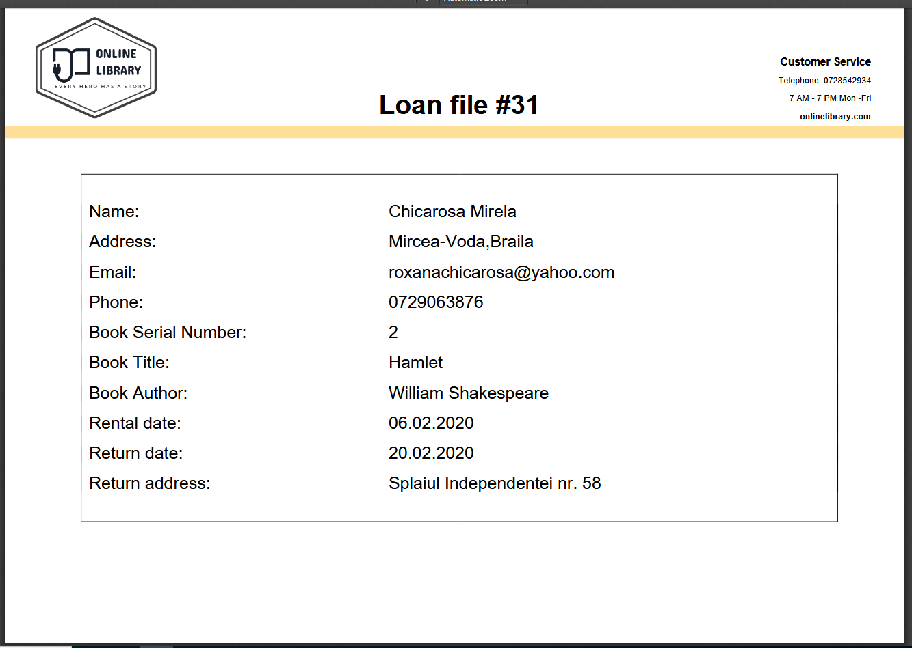
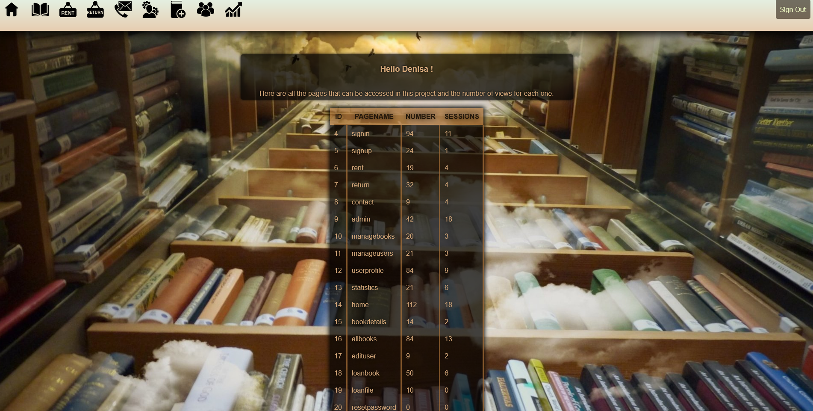

# Library-management-in-php
This is a php project for managing an online library.

## Requirements
* The project uses a MySQL database programmed in PHP.
* Through the application, commands like delete, add and read from the database are performed
* There is a user authentication / registration pag wih email verification code
* There are several categories of users. Each category has specific actions.
* The application contains several dynamic pages with links between them
* There is the possibility of generating and viewing reports (not just HTML and PHP)
* Statistical elements of the site: views and loads of each page
* Contact form, with the possibility of sending emails
* Integration of information (not entire pages, but only elements of them) from other sites
* End of session

## User manual

### Home page
This page is available for unregistered visitors. 
It gives access to:
* register page 
* log in page 
* book page (it contains a list of books available in the library)

### Register page
This page has multiple input fields in order to build an user profile.
Each field has type restrictions as "alphas only" for first and last name fields, ten digits for phone number, etc.
After the form is completed and the submit button is pressed, a verification code is sent on the inserted email.

 

### Sign In page
This page offers the posibility to enter in you account (already registered).

### User profile
This page offers information about:
 * all books in the library (available or not)
 * previous and current loans
 * wish-list 
 
 
 
 ### Rent book
 This page offers the posibility to select one of the available books and complete a loan file.
 After all the details are completed, the users receives a loan file in PDF format.
  
   
 
 ### Return book
 The user has to insert de index number of the loan file. After this step, the application send the information to the admin group and admins can check if the book has been returned.
 
 
 
 ### Contact page
 The user can file a contact form. After hitting the submit button, an email will be sent to the admin address.
 
 
 ### Admin page
 This page is the first page for an admin account. The user with admin role can check if the return applications are verified.
 For each return application the admin has to set the tag as: returned or still rented.
 
  
  
  ### Manage books
  This is a page available only for users with admin role. Here they can add or remove books.
  
   
   
  ### Manage users
  This is a page available only for users with admin role. Here they can edit users details and roles.
  
   
   
   ### Statistic page
   This page shows the number of loads and different sessions for each page available on the application.
   
   
   
   
